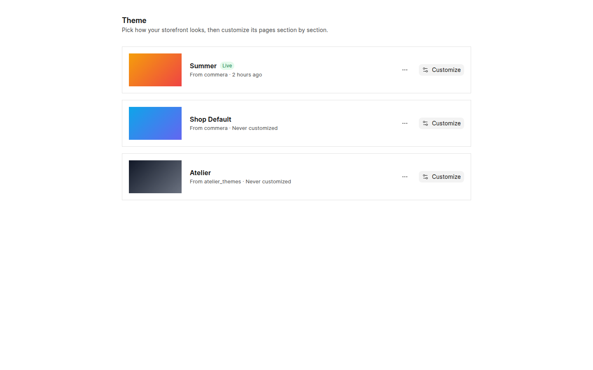
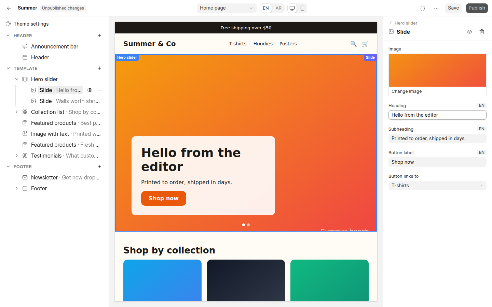
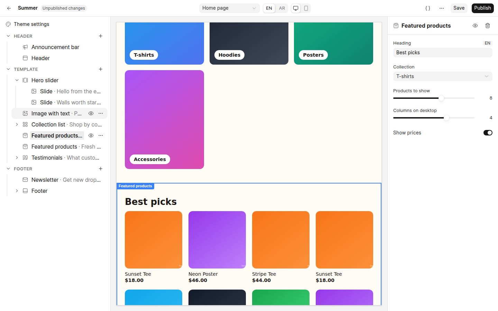
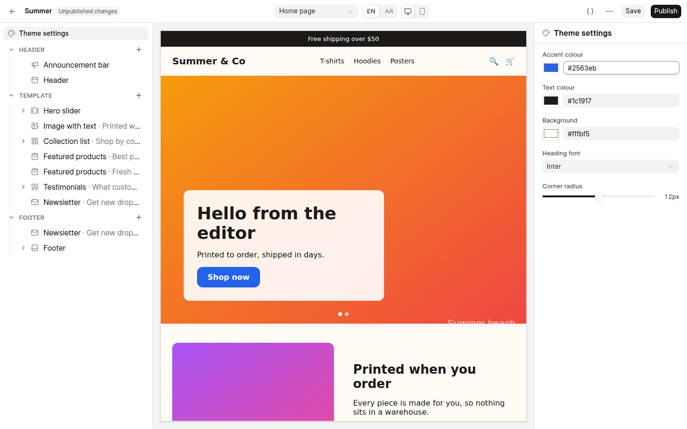
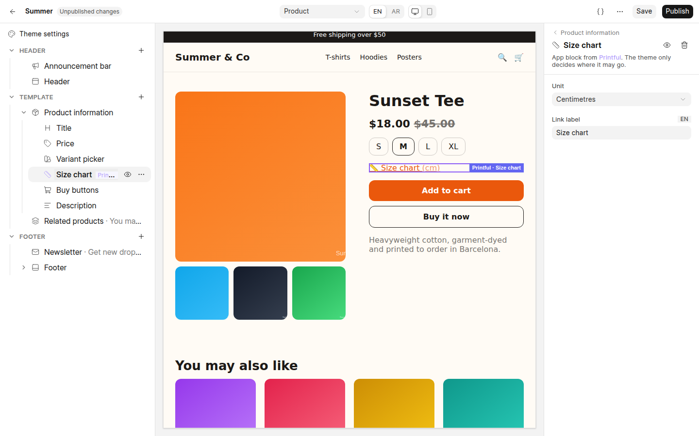
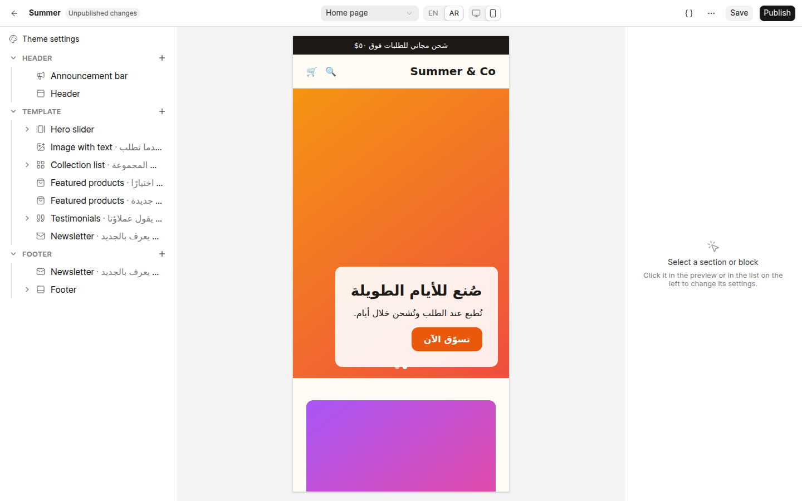
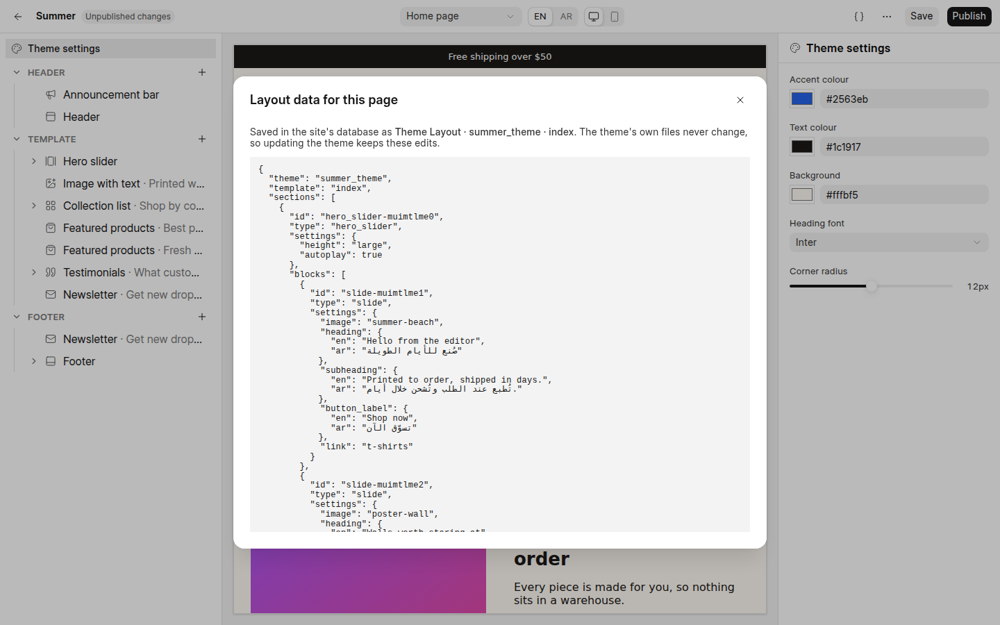

# Commera Apps — Theme sections, page layouts and storefront app blocks

Spec 4 of 4. How merchants customize a Jinja theme without touching code, how theme developers make
that possible, and how apps put UI on the storefront. It extends [spec 1](01-developer-api.md)'s
registry with storefront targets and reuses [spec 2](02-platform-implementation.md)'s isolation
rules. The interaction was agreed on a working prototype, [`poc/theme-editor/`](../../../poc/theme-editor/);
screenshots below come from it.

Status: draft.

## Why

Today a theme exposes one settings doctype (`Summer Theme Settings`, …) and its pages are fixed
`` chains (`themes/summer_theme/pages/index.html`). Merchants can change values but not
what is on a page or in what order, and apps have nowhere to render on the storefront except the
merchant-pasted "Custom Tracking Scripts" in `<head>`.

Shopify's answer, which this follows: the **theme owns code** (sections, their schemas, default
layouts); the **merchant owns data** (which sections are on each page, in what order, with what
values), edited in a visual editor; **apps own blocks** that merchants place into sections that accept
them. Frappe Builder stays a separate, later option for free-form pages; it is out of scope here.

## Goals

- Merchants add, remove, reorder, hide and configure sections and blocks per page, with a live
  preview, in English and Arabic, without editing Jinja.
- Theme updates never overwrite merchant work, and merchant work never leaks into theme files.
- Apps render on the storefront through declared slots, and disappear cleanly on uninstall.

## Non-goals (v1)

- Reusable nested "theme blocks" across sections (Shopify's `@theme`). v1 blocks belong to one section.
- Per-page header/footer variants. Header and footer groups are shared by all pages.
- Layouts for checkout and account pages. They stay fixed templates (as on Shopify).
- Dynamic sources (binding a setting to a record field). Open question.

---

## 1. The merchant experience

**Themes list.** The dashboard's Theme screen lists installed themes; each has **Customize**.



**Editor.** Full screen, three panels:

- **Left — the page's tree.** Header group, the page's Template sections, Footer group; blocks nest
  under their section. Drag to reorder (sections within their group, blocks within their section),
  hide, duplicate, remove, **+** to add a section from the theme's presets or a block (theme blocks,
  and app blocks where the section accepts them). The page's main section cannot be removed.
- **Centre — live preview** of the selected page, desktop or mobile, English or Arabic (RTL). Hovering
  outlines what a click would select; clicking a section or block selects it.
- **Right — settings** of the selection, generated from its schema. Translatable fields edit the
  language being previewed and fall back to English.



The top bar picks the **page** (Home, Product, Collection, …), language and device, and holds **Save**
(draft), **Publish** (make live) and **Discard unpublished changes**. **Theme settings** at the top of
the tree edits global values (colours, fonts, radius).

| | |
| --- | --- |
|  |  |
| Dragging *Image with text* above *Collection list* | Theme settings restyle every page |
|  |  |
| Printful's *Size chart* app block inside the product section | Arabic preview, right-to-left, mobile width |

**Draft and publish.** Layout edits go live only on **Publish**. This is a deliberate exception to the
dashboard's "settings save per field" rule: rearranging a live homepage is not a field that settles.
Save keeps a server-side draft so work survives reloads and devices.

---

## 2. Theme developer API

### 2.1 Files

```
<app>/themes/<slug>/
├── sections/
│   ├── hero_slider.html          # Jinja: renders one section
│   ├── hero_slider.json          # schema: settings, blocks, presets
│   └── hero_slider.py            # optional controller: get_context(section, page)
├── layouts/                      # default layouts shipped with the theme
│   ├── index.json  product.json  collection.json  page.json
│   └── groups/header.json  groups/footer.json
├── settings.json                 # global theme settings schema
├── pages/…                       # existing page templates; they call render_layout()
└── components/…                  # unchanged
```

Schemas are sibling JSON, not a tag inside Jinja: the dashboard reads them without rendering, and
they validate like data. Everything else about the theme engine (inheritance through
`parent_theme`, `ThemeFallbackLoader`, assets) is unchanged; `sections/` and `layouts/` resolve
through the same child-first chain, so a child theme can override one section.

### 2.2 Section schema

```json
{
  "name": "Hero slider",
  "icon": "gallery-horizontal",
  "settings": [
    { "id": "height", "type": "select", "label": "Height", "default": "large",
      "options": [{ "value": "small", "label": "Small" }, { "value": "large", "label": "Large" }] },
    { "id": "autoplay", "type": "check", "label": "Autoplay slides", "default": true }
  ],
  "blocks": {
    "slide": {
      "name": "Slide",
      "settings": [
        { "id": "image", "type": "image", "label": "Image" },
        { "id": "heading", "type": "text", "label": "Heading", "translatable": true },
        { "id": "link", "type": "collection", "label": "Button links to" }
      ]
    }
  },
  "accepts_apps": false,
  "max_blocks": 5,
  "presets": [{ "blocks": ["slide", "slide"] }],
  "static": false,
  "groups": null,
  "templates": null
}
```

| Key | Meaning |
| --- | --- |
| `settings` / `blocks.<type>.settings` | Typed fields (below) |
| `accepts_apps` | App blocks may be placed in this section (Shopify's `@app`) |
| `max_blocks` | Editor refuses more |
| `presets` | What **Add section** inserts |
| `static` | Part of the page: reorderable, not removable (e.g. product information) |
| `groups` | `["header"]` / `["footer"]`: lives in a shared group, not a page |
| `templates` | Restrict to page types, e.g. `["product"]` |

Setting types map to docfield types, so the dashboard's `SettingsFieldControl` renders them:

| Type | Docfield | Stored as |
| --- | --- | --- |
| `text`, `textarea`, `url` | Data, Small Text, Data | string, or `{"en","ar"}` if `translatable` |
| `check` | Check | boolean |
| `select` | Select | option value |
| `range` | Int (`min`, `max`, `step`, `unit`) | number |
| `color` | Color | hex |
| `image` | Attach Image | file URL |
| `collection`, `product`, `page` | Link (Item Group, Style Attribute Variant, Shop Web Page) | record name |

`settings.json` uses the same setting types for global values; its values are exposed to every
template as `theme_settings` and as CSS variables.

### 2.3 Rendering

```jinja
{# pages/index.html #}

{{ render_layout("index") }}
```

```jinja
{# sections/hero_slider.html — receives `section` and page context #}
<div class="hero hero-{{ section.settings.height }}">
  
    {{ render_block(block) }}      {# theme block template or app block #}
  
</div>
```

- `render_layout(template)` renders header group, the page's sections, footer group, in order,
  skipping hidden ones. Each section is wrapped in `<section id="section-<id>" data-section-type=…>`.
- `render_block(block)` renders a theme block through the section's own template (a macro named after
  the block type, `` in the section file) or an app block (§4).
- `sections/<type>.py` `get_context(section, page) -> dict` loads data once per render, replacing the
  queries sections run inline today (e.g. `sponsored_brands.html` calls `frappe.get_all`).
- Translatable values resolve to the request language (`/en`, `/ar`) with English fallback before the
  template sees them: templates write `{{ section.settings.heading }}`.
- **Failure isolation:** a section whose controller or template raises is skipped and logged
  (`frappe.log_error`); the rest of the page renders. In the editor preview the failure shows as a
  placeholder naming the section.
- **Unknown data is ignored:** a section type no longer in the theme is skipped (and flagged in the
  editor); a setting id no longer in the schema is ignored; a new one takes its default.

---

## 3. Data and platform

### 3.1 Theme Layout (DocType)

| Field | |
| --- | --- |
| `theme` | Link Shop Theme |
| `template` | `index`, `product`, `collection`, `page`, `group:header`, `group:footer`, `settings` |
| `layout` | JSON: the draft (`sections[]` with `id, type, disabled, settings, blocks[]`) |
| `published_layout` | JSON: what the storefront renders |
| `published_on`, `published_by` | Audit |

Unique on (`theme`, `template`). **Absent row = the theme's default layout file.** The first edit copies
the default into a row; from then on the site owns it. Publish copies `layout` to `published_layout`
for every changed row of the theme in one transaction.

This is the one intentional difference from Shopify, whose `templates/*.json` are files inside each
store's copy of the theme. A bench serves one theme's files to every site, so merchant data must live
in each site's database, or it would leak across sites and be lost on `git pull`.



### 3.2 Endpoints (`commera.api.admin.theme_editor`)

| Method | Does |
| --- | --- |
| `get_editor(theme)` | Schemas (sections, blocks, app blocks, settings), page list, draft layouts |
| `save_layout(theme, template, layout)` | Validates against schemas; writes the draft |
| `publish(theme)` / `discard(theme)` | Promote / reset every draft of the theme |
| `render_preview(theme, template, layout, language, section_id=None)` | HTML for the preview; with `section_id`, just that section (fast re-render while typing, Shopify's Section Rendering API) |

Validation: known section/block types, `max_blocks`, static sections present, setting types and
link targets, `templates`/`groups` placement.

### 3.3 Preview protocol

The preview iframe is the existing `theme_editor_preview` route rendering the **draft** in editor
mode (tracking blocks blanked, as `chrome_preview.py` already does). Editor and preview talk only by
`postMessage` on the same origin:

| Message | Direction | Payload |
| --- | --- | --- |
| `commera:preview-ready` | preview → editor | — |
| `commera:render` | editor → preview | layout (or one section's HTML), language, selection, scroll |
| `commera:select` | preview → editor | section or block id |

Editor mode adds `data-section-id` / `data-block-id` wrappers and hover/selection outlines; the
live storefront never renders them.

### 3.4 Caching and permissions

- Published layouts are cached per (theme, template) and cleared on publish; rendered pages follow
  the existing theme cache.
- Editing requires `Website Manager` (or System Manager). A **Custom HTML** section (the equivalent
  of Shopify's Custom Liquid) exists but only System Managers can add it; all other values are escaped.

---

## 4. Storefront app blocks

Apps register storefront UI through the same `get_extensions()` builders as spec 1:

```python
from commera.sdk.extensions import storefront_block, storefront_embed

def get_extensions():
    return [
        storefront_block(
            "size_chart",
            name="Size chart",
            template="print2commera/storefront/size_chart.html",
            settings=[{"id": "unit", "type": "select", "options": ["cm", "in"], "default": "cm"}],
            templates=["product"],              # where it may be placed
            javascript="print2commera/storefront/size_chart.js",
            condition=is_printful_product,      # (doctype, name) -> bool, per page render
        ),
        storefront_embed("chat_bubble", template="…/bubble.html", target="body_end"),
    ]
```

| | App block | App embed |
| --- | --- | --- |
| Placed by | Merchant, into a section with `accepts_apps` | Merchant switches it on per theme |
| Renders | Inside the section, via `render_block()` | At `head` or `body_end` of every page (`components/base.html` gets both slots) |
| Receives | `block.settings`, page context (`product`, …), `app_data(record)` | Global context |
| Use | Size charts, reviews, subscriptions, loyalty points | Chat, popups, badges, pixels |

Rules (from Shopify's theme app extension model):

- Apps never write theme files. A placement is a reference in the layout JSON:
  `{"type": "app:print2commera/size_chart", …}`.
- On uninstall the registry stops returning the block; the renderer skips unknown app block types, so
  placements vanish without cleanup. Reinstalling brings them back.
- An app block's JS/CSS load once per page, only where the block is placed. Budgets: 10 KB JS and
  100 KB CSS gzipped per block (Shopify's numbers); `bench commera extensions validate` warns above.
- App block templates render in the same failure isolation as sections.
- Placements are per theme: switching themes does not carry them over (as on Shopify); the editor
  lists enabled apps with no placement in the active theme.

### 4.1 Storefront events

So app blocks do not depend on a theme's markup, the theme's Alpine stores emit and accept standard
events (Shopify's standard storefront events and actions):

| Event (window) | When |
| --- | --- |
| `commera:cart:updated` | Cart store changed (`cart-state`) |
| `commera:variant:changed` | Product page selection changed |
| `commera:cart:add` (dispatch to request) | App asks the theme to add `{item_code, qty}` |
| `commera:cart:open` (dispatch to request) | App asks the theme to open its cart |

Every theme's base layout must implement them; the theme test suite checks it, as it already checks
required blocks (`test_theme_engine.py`).

---

## 5. Migrating the shipped themes

1. **Summer, home page.** Its 19 `components/sections/*.html` become `sections/*.html` + `.json`.
   `pages/index.html` becomes `render_layout("index")`. The home content in **Summer Theme
   Settings** (hero slides, picks, banners, titles) moves into `layouts/index.json` section settings;
   a patch copies each site's current values into its Theme Layout rows so nothing visibly changes.
2. **Summer, product and collection pages.** `pages/products/details.html` becomes a layout whose
   static `main_product` section has blocks (title, price, variant picker, buy buttons, description)
   with `accepts_apps`; gallery, tabs and related products become movable sections.
3. **Shop Default.** Same conversion; its `templates/partials/*` includes become sections.
4. **Global settings.** Values that are truly global (colours, fonts, logo) move to `settings.json`;
   the per-theme settings doctypes are retired after the patch.
5. Checkout, cart and account pages keep their templates.

---

## 6. Phases

| Phase | Ships |
| --- | --- |
| T1 Engine | Section schemas, `render_layout` / `render_block`, section controllers, Theme Layout, default layouts, failure isolation, validation |
| T2 Summer home | Convert Summer's home page + patch; unchanged storefront output is the acceptance test |
| T3 Editor | Dashboard editor as prototyped: tree, preview, settings, draft/publish, EN/AR, devices |
| T4 Product and collection | Main sections with blocks; convert Summer and Shop Default |
| T5 App blocks | `storefront_block` / `storefront_embed`, `accepts_apps`, events, uninstall behaviour; Printful size chart as the acceptance test |

## Open questions

- Version history for published layouts (restore last N publishes)?
- Dynamic sources: bind a setting to a record field (e.g. product material) instead of a fixed value?
- Per-page header/footer overrides, or keep groups shared?
- Frappe Builder pages: can Builder reuse section schemas as Builder blocks later (separate spec)?
