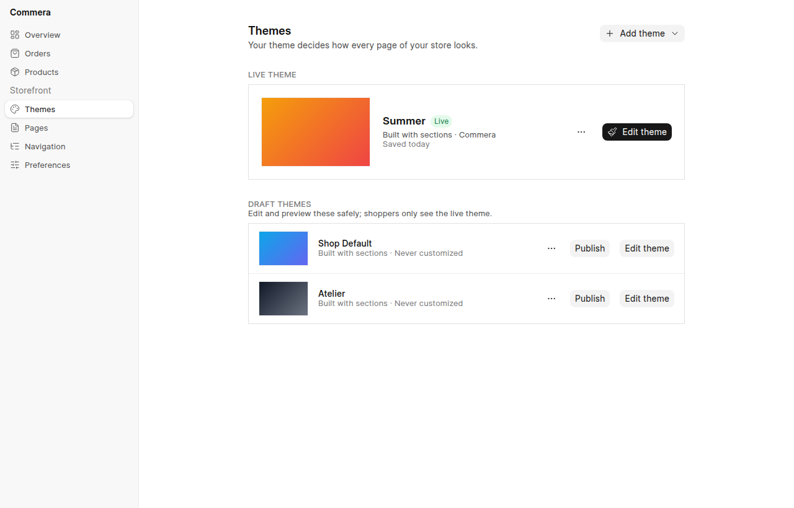
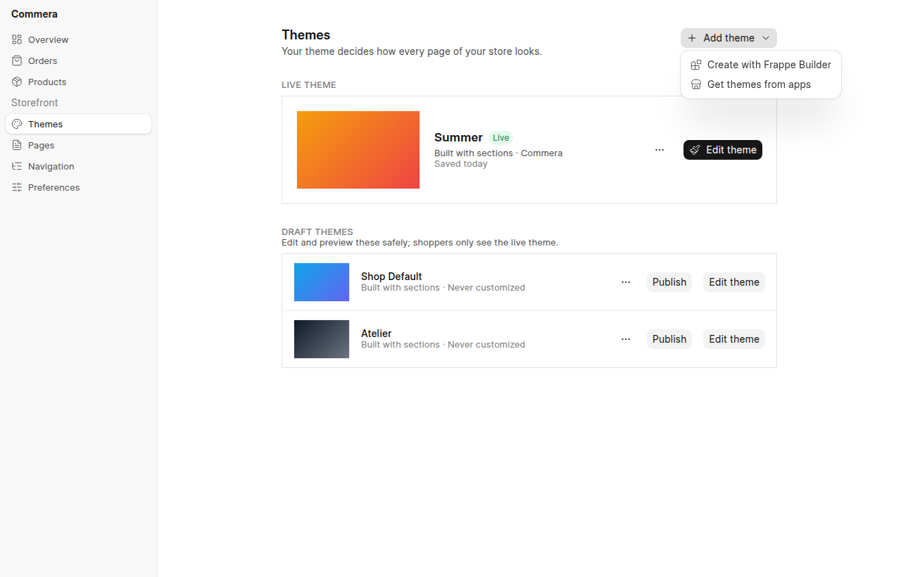
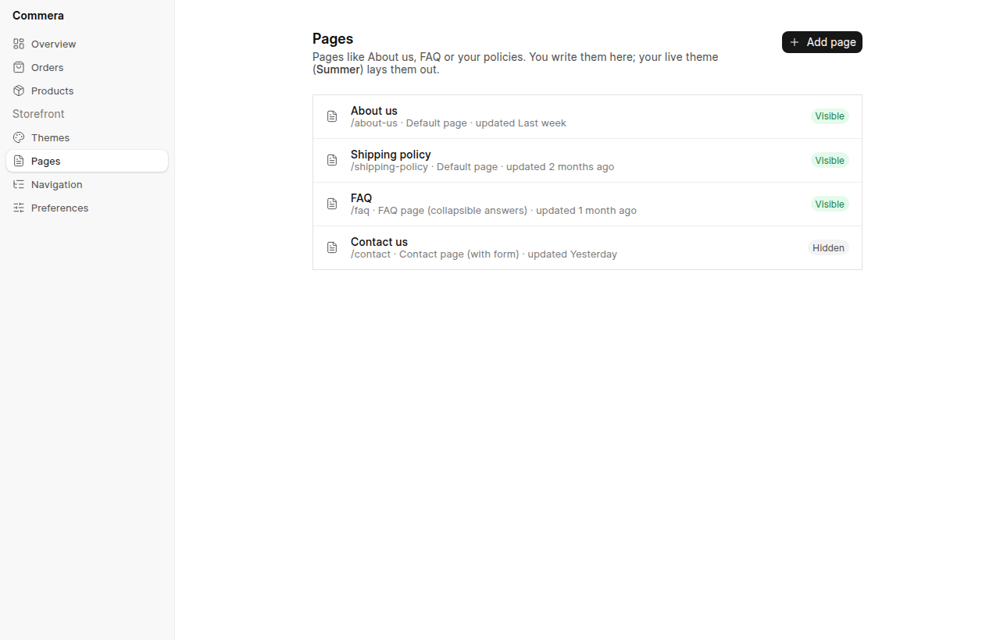
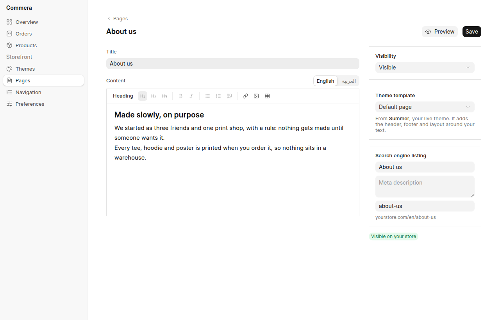
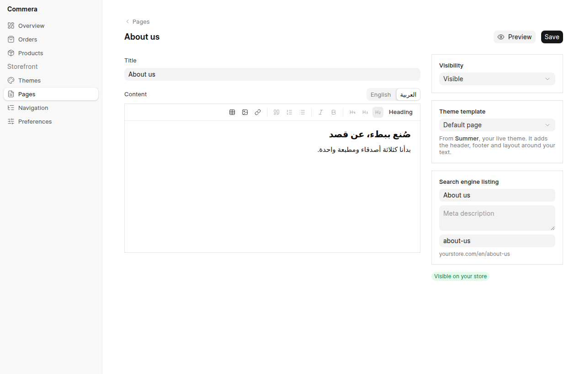
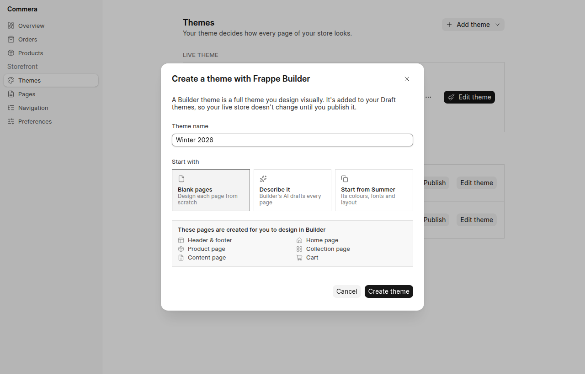
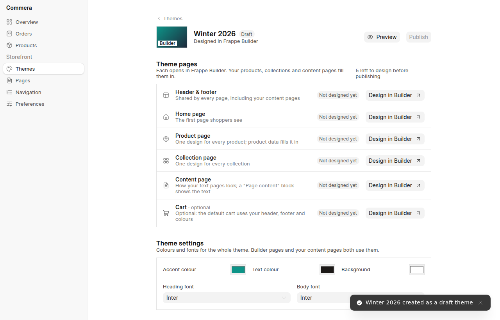
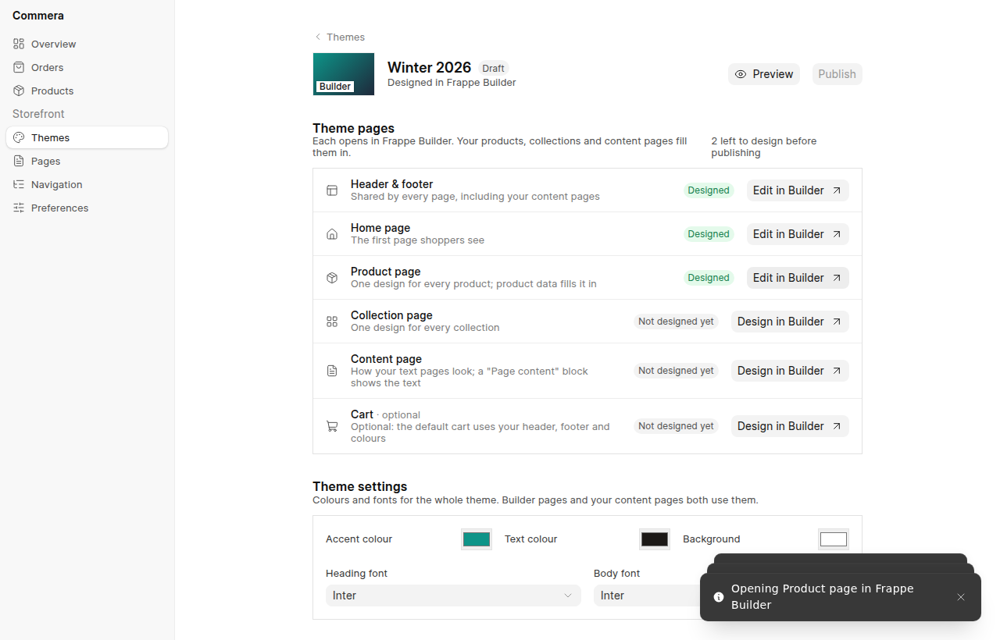
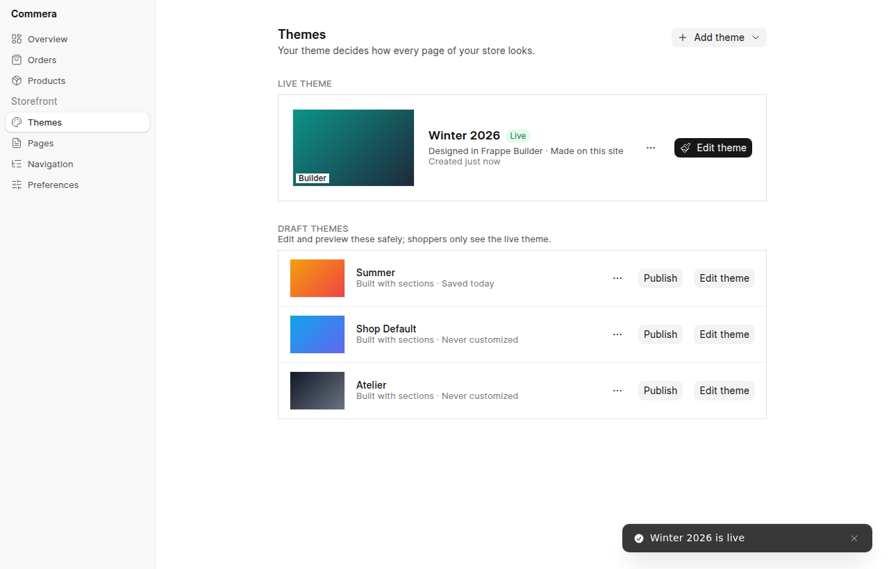

# Commera Apps — Storefront information architecture and Builder themes

Spec 6 of 7. This spec covers how the dashboard's Storefront area is organised: themes, content pages,
navigation and preferences. It also covers where Frappe Builder fits, which is as a second kind of
theme and not as a second kind of page.

- It sits above [spec 4](04-theme-sections-and-layouts.md), whose section editor is the "Edit theme"
  screen for sections themes.
- It turns [spec 5](05-frappe-builder-storefront.md)'s research into a merchant-facing model, and
  replaces spec 5's `storefront_source` switch and page map.

The structure was agreed on the prototype at [`poc/theme-editor/`](../../../poc/theme-editor/)
(`/storefront`, walked through by `node storefront.mjs`), and the screenshots below come from it.

Status: draft.

## Why

Merchants currently meet three overlapping ideas: the theme, "pages", and (soon) Frappe Builder. The
prototypes that let Builder pages sit next to theme pages, or inside the theme editor, left the
merchant working out which tool owned which page, and the review called them "too much mix and match".

Shopify's Online Store shows a cleaner split, which this spec follows:

- **Themes are the core.** Exactly one theme is live. The others are drafts, which merchants can edit
  and preview safely and then publish. A theme decides how *every* page looks, and its settings
  (colours, fonts) belong to it.
- **Pages are content.** An About page is a title, rich text, a visibility switch and SEO fields.
  Its only link to the look is a "Theme template" picked from the live theme.

Builder fits into this as a way to **make a theme**. "Create with Frappe Builder" creates a new draft
theme whose pages are designed in Builder. Everything else stays the same: Publish, Edit theme, theme
settings, and content pages that survive a theme switch.

## Goals

- One rule a merchant can learn: *the theme is how the store looks; pages are what it says.*
- Creating, previewing and publishing a theme work the same whether it was built with sections or in
  Builder.
- Content pages (About, FAQ, policies) are written once and render correctly under any live theme,
  in English and Arabic.
- Builder never appears as a separate page system in the dashboard.

## Non-goals (v1)

- Free-standing Builder landing pages (for example a one-off "Summer sale" page). See open questions.
- Cart, checkout and account pages designed in Builder. As in spec 4, they stay Commera-rendered
  and use the live theme's header, footer and settings.
- Theme marketplace UI. "Get themes from apps" lists themes that installed apps ship (spec 1).

## 1. Primary IA

```
Storefront
├─ Themes          Live theme · Draft themes · Add theme
│   ├─ Edit theme  → section editor (sections theme, spec 4)
│   │              → theme pages + settings (Builder theme, §3)
│   └─ Add theme   ├─ Create with Frappe Builder
│                  └─ Get themes from apps
├─ Pages           content pages: rich text, visibility, theme template, SEO
├─ Navigation      menus (header, footer)
└─ Preferences     store name, logo, favicon, social image, password page
```

Today's dashboard has `/storefront/theme`, `/storefront/pages` and `/storefront/navigation`. This
spec renames `theme` to `themes`, since it becomes a list, and adds `preferences`.

### 1.1 Themes



- **Live theme** is a single card with its thumbnail, name, kind ("Built with sections" or "Designed
  in Frappe Builder"), source (Commera, an app, or "Made on this site") and when it was last saved.
  - Its actions are **Edit theme** (primary) and ⋯ (Preview, Rename, Duplicate).
- **Draft themes** covers every other installed or created theme.
  - Each has **Publish**, **Edit theme** and ⋯ (Preview, Rename, Duplicate, Delete, where Delete
    applies only to themes made on this site).
  - **Publish** asks for confirmation, then swaps the live theme; the old live theme becomes a draft.
    Nothing is lost, and switching back is one click.
- **Add theme** is a menu:

  

  - **Create with Frappe Builder** is covered in §3.
  - **Get themes from apps** lists installable themes from installed apps.

This replaces spec 4's Themes list (its §1 "Customize" screen). Spec 4's editor is unchanged and is
what **Edit theme** opens for a sections theme.

### 1.2 Pages



The list shows each page's title, route, theme template and last update, with a Visible or Hidden
badge. The copy names the live theme: "You write them here; your live theme (**Summer**) lays them
out."



- **Title** and **Content**. The content is the frappe-ui rich text editor (headings, lists, links,
  images, tables), with **English** and **العربية** tabs. Arabic is edited right-to-left, and an
  empty Arabic body falls back to English on the Arabic store.
- **Visibility** is Visible or Hidden.
- **Theme template** is a Select filled from the *live* theme's page templates (for example
  `page`, `page.contact`, `page.faq`). The helper text names the theme so the dependency is visible.
  If the live theme later lacks the chosen template, the page falls back to `page` (§2.3).
- **Search engine listing** holds the title, description and URL handle, with a preview of the URL.



Pages keep the dashboard's usual save behaviour, with **Save** and **Preview**. They are content, not
theme layout, so spec 4's Draft/Publish does not apply to them.

### 1.3 Navigation and Preferences

- **Navigation** is the existing menus screen. Themes render menus by handle (`main`, `footer`),
  whatever their kind; a Builder theme's header reads the same menus (§3.3).
- **Preferences** holds store-level identity that must not change when the theme does: name, logo,
  favicon, default social image and password protection.

## 2. Data model

### 2.1 Shop Theme (existing, extended)

`Shop Theme` already has `theme_name`, `is_standard`, `module`, `theme_settings` (a per-theme
settings DocType), `parent_theme` and `config`. This spec adds:

| Field | Type | Notes |
|---|---|---|
| `kind` | Select: `Sections`, `Frappe Builder` | Defaults to `Sections`. Decides what Edit theme opens and how templates resolve. |
| `title` | Data | The display name. `theme_name` stays the stable key; Rename edits `title` only. |
| `source_app` | Data | The app that ships the theme, or empty for themes made on the site. |
| `thumbnail` | Attach Image | Optional. Without one, a gradient is drawn from the theme's accent colours. |
| `builder_pages` | Table: `Shop Theme Builder Page` | Builder themes only (§3.1). |
| `settings` | JSON | Builder themes only: colours and fonts (§3.3). A sections theme keeps its settings DocType plus spec 4's Theme Layout settings. |

Which theme is live stays `Shop Theme Settings.active_theme`, so Publish is a single write to it.
"Draft" is every other `Shop Theme`, so no status field is needed. Duplicate copies the record, and
for sections themes also copies its Theme Layout rows (spec 4 §3.1), under a new `theme_name`.

### 2.2 Shop Web Page (existing, extended)

`Shop Web Page` already has `route`, `published`, `content`, `content_ar`, `meta_title`,
`meta_description`, `og_image` and `noindex`. It gains one field:

| Field | Type | Notes |
|---|---|---|
| `template` | Data | A page template suffix: empty or `page` means the default, `contact` means `page.contact`. Stored as a name, not a link, so that it survives theme switches. |

In the UI, `published` is labelled **Visibility**.

### 2.3 Resolving a content page

`ThemePageRenderer`, for a `Shop Web Page` route, works as follows:

1. Load the live theme.
2. For a **sections** theme, render the theme's `templates/page.<template>` layout, falling back to
   `page`. The layout contains a main **Page content** section that outputs the page's rich text
   for the current language. This is a spec 4 static section, just as `main_product` is on product
   pages.
3. For a **Builder** theme, render the theme's Builder page for the `page` role (§3.1), which
   contains a **Page content** block (§3.2).

A theme lists the page templates it offers in its `theme.json` (sections) or its `builder_pages`
rows (Builder). The Theme template Select reads that list.

## 3. Builder integration

### 3.1 Create with Frappe Builder



The dialog has three fields:

- **Theme name**.
- **Start with**:
  - **Blank pages**;
  - **Describe it**, where Builder's AI (Bob) drafts every page from a prompt;
  - **Start from the live theme**, which copies its colours and fonts, and for a Builder theme also
    its pages.
- A read-only list of the pages that will be created.

**Create theme** runs `commera.api.admin.themes.create_builder_theme(title, start, prompt=None)`:

1. It inserts a `Shop Theme` with `kind = Frappe Builder`, `is_standard = 0` and `source_app` empty.
2. For each theme page role it creates an **empty Builder Page**, unpublished, with a route under a
   reserved prefix (`/__theme/<theme>/<role>`) so that Builder never serves it directly. It links
   the page in `builder_pages`:

   | Role | Required | Builder page is… | Data it receives |
   |---|---|---|---|
   | `chrome` | yes | a Builder **component** (header + footer), used by every other role and by Commera-rendered pages | menus, cart count, store identity |
   | `index` | yes | a static page | featured collections, sample products |
   | `product` | yes | a dynamic page | the product context from `www/products/details.py` |
   | `collection` | yes | a dynamic page | the collection context, including filters and pagination |
   | `page` | yes | a page with a **Page content** block | the content page's title and rich text |
   | `cart` | no | a page with the Commera cart component | the cart; without this page, the default cart uses `chrome` + settings |

3. With **Describe it**, it enqueues one Bob run per required page, carrying the prompt and the
   role's context (§3.4). The pages show **Drafted** until the merchant opens them.
4. It returns the theme, and the dashboard opens its **Edit theme** screen.

The new theme is a draft, so the live store is untouched.

### 3.2 Edit theme (Builder)



- **Theme pages** lists one row per role, each with a status:
  - **Not designed yet**: the Builder page has no blocks.
  - **Drafted**: Bob wrote it and no human has saved it yet.
  - **Designed**: saved in Builder.

  Each row has **Design in Builder ↗** (or **Edit in Builder ↗**), which opens
  `/builder/page/<name>` in a new tab. The status refreshes when the tab regains focus.
- **Publish** is disabled until every required role is Designed; the header says how many are
  left. Publishing a Builder theme is the same write as for any theme (§2.1). Before that write,
  Commera publishes the theme's Builder pages, which stay under the reserved prefix, and Commera
  routes to them (§3.3).
- **Theme settings** hold accent, text and background colours plus heading and body fonts. They
  are stored in `Shop Theme.settings` and pushed to Builder as design tokens, so Builder pages and
  Commera-rendered pages (content, cart, checkout) share them.




Once published, the Builder theme is the live theme, and the previous sections theme becomes a
draft, still editable in its section editor.

### 3.3 Rendering a Builder theme

`ThemePageRenderer` already runs first for storefront routes. When the live theme's kind is
`Frappe Builder`:

- **Home, product and collection routes** are served by the Builder page for that role. Commera
  builds the same context the sections theme gets and hands it to the page's render, as described
  in spec 5 §3 "Rendering and context". Spec 5's B0 spike (render with context versus subclassing)
  applies unchanged.
- **Content pages** render the `page` role with the `Shop Web Page` in context, and the **Page
  content** block outputs `content` or `content_ar`.
- **Chrome.** Every Builder page role and every Commera-rendered page (cart, checkout, account)
  includes the `chrome` component, so the whole store looks like one theme. This answers spec 5's
  open question about the header and footer.
- **Settings.** `Shop Theme.settings` is written into Builder's design tokens when it is saved,
  and emitted as CSS variables for Commera-rendered pages.
- **Menus.** The header and footer bind to Commera's menus by handle, so they are edited in
  Storefront → Navigation, not in Builder.

This replaces spec 5's `storefront_source` switch and **Shop Builder Page Map**. The mapping from
template to Builder page lives on the theme (`builder_pages`), so choosing Builder is simply
publishing a Builder theme.

### 3.4 What Commera ships into Builder

Spec 5 §3 and §5 cover these. They are listed here to show which asks each piece of the merchant
flow depends on:

| Piece | Used by | Upstream need (spec 5 §5) |
|---|---|---|
| Commera components (product gallery, price, variant picker, add to cart, product grid, cart, **Page content**, **Theme chrome**) via `builder_files` | every role | none |
| Role context for binding, editor preview and sample data | product, collection, page | ask 3 (data providers); a renderer hook until then |
| Bob context: "this page is the `product` role of theme *Winter 2026*; keys available; cart and checkout are off-limits" | Describe it, and later edits | ask 1 (AI context) |
| Bob tools: `commera.sample_product`, `commera.list_collections`, `commera.theme_pages` | Describe it | ask 2 (AI tools) |
| Theme settings → Builder tokens | Theme settings | none (Builder's tokens are site data) |
| A "Commerce" panel in Builder | designing pages | ask 4 + #875 part 4 (optional sugar) |

Without asks 1–3, the flow still works: **Blank pages** plus Commera components, with context
injected by the renderer. **Describe it** is hidden until ask 1 lands.

## 4. Endpoints (`commera.api.admin.themes`)

| Method | Does |
|---|---|
| `list_themes()` | The live theme and the drafts, each with kind, source, saved time and thumbnail colours. |
| `publish_theme(theme)` | Checks required Builder roles, publishes the Builder pages, and sets `active_theme`. |
| `duplicate_theme(theme, title)` / `rename_theme(theme, title)` / `delete_theme(theme)` | Delete is only for themes made on the site that are not live, and removes their Builder pages. |
| `create_builder_theme(title, start, prompt=None)` | Covered in §3.1. |
| `builder_theme_status(theme)` | Each role's status, derived from the Builder Page's blocks and `modified_by`. |
| `page_templates()` | The live theme's page templates, for the Theme template Select. |

All of them require the Commera admin role. Builder pages are created as that user, so Builder's own
permissions apply when the page is opened.

## 5. Phases

| Phase | Scope | Depends on |
|---|---|---|
| S1 | Themes list (live, drafts, Publish, Duplicate, Rename), Pages gains Theme template and Visibility copy, Preferences screen | spec 4 T1 for the sections editor link |
| S2 | Page content section and `page.*` templates in shipped themes; content pages resolve through the live theme | spec 4 T2 |
| S3 | Builder themes with Blank pages: create, theme pages list, Commera components, role rendering, `chrome` on Commera pages, settings → tokens | spec 5 B0 spike, B1 |
| S4 | Describe it (Bob drafts every role) | Builder asks 1–2 |
| S5 | Data providers replace renderer injection; Commerce panel | Builder asks 3–4 |

## Open questions

- **Required roles.** Are search and 404 pages required roles, optional ones like cart, or always
  Commera-rendered with `chrome`?
- **Alternate templates in Builder themes.** Should a Builder theme be able to add `page.contact`
  and `page.faq` roles (the "Create template" equivalent), or does it get one `page` role in v1?
- **Landing pages.** Should one-off campaign pages be alternate templates of the live theme
  (Shopify's model), or should Builder pages be allowed back as a separate list? This spec leans
  towards templates.
- **Arabic in Builder themes.** Should there be one Builder page per role with translatable
  bindings, or one page per role and language? Spec 5 raised the same question.
- **Switching kinds.** Is "Start from the live theme" for a sections theme enough (colours and fonts
  only), or should Commera generate starter Builder pages from the sections layout?
