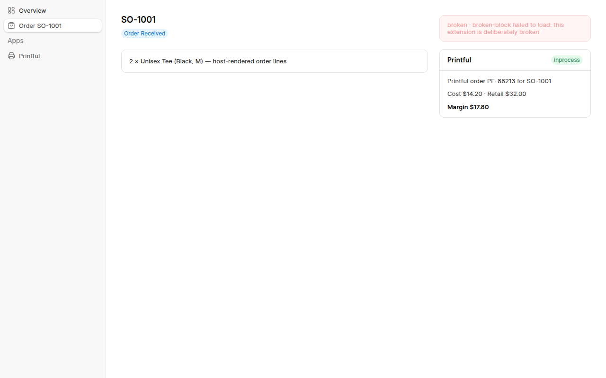

# Extension runtime POC

A front-end-only proof of the runtime in [spec 2 §2](../../docs/specs/commera-apps/02-platform-implementation.md):
a frappe-ui host app that is **built once**, and extensions from **other folders, built separately**,
loaded at runtime and rendered with the host's own Vue and frappe-ui.

No Frappe here. `server.mjs` plays Frappe's part: it serves the host build, each app's build under
`/assets/<app>/commera/`, a registry standing in for `boot.extensions`, and a few mock whitelisted
methods.

```
host/        frappe-ui app (the "dashboard"). Its build exposes vue, frappe-ui and
             @commera/admin through an import map, and emits classes.json and
             shared-exports.json for the kit.
kit/         @commera/extension-kit/vite: the one build config every app uses.
apps/
  printful/  extensions.json (stands in for get_extensions())
             commera/printful-page, commera/printful-order-block
  broken/    one block that throws, to prove isolation
server.mjs   stand-in for Frappe
verify.mjs   drives the build in Chromium and checks every claim below
measure*.mjs bundle-size measurements
```

## Run

```bash
npm install
npm run build        # host once, then each app on its own
npm run verify       # 15 checks, screenshots in ./screenshots
npm run serve        # http://localhost:4173 to click around
node measure.mjs && node measure-transfer.mjs
```

Rebuild a single app (`npm run build -w apps/printful`) and reload: the change shows up with the host
untouched, because the server stamps each module URL with `?v=<mtime>`.

## What it proved

`npm run verify`, all 15 passing:

| Claim | How it is checked |
| --- | --- |
| An app adds a sidebar link to a host built without it | Link from `apps/printful/extensions.json` renders in the host's Apps section |
| Extension modules load from the app's own folder | `/assets/printful/commera/printful-page.js` fetched at runtime |
| Extensions use the host's data helpers | `useMethodRead` (frappe-ui `useCall`) from `@commera/admin` returns mock data |
| One frappe-ui instance | A `toast()` raised in the extension — from `useExtension()` or imported straight from `frappe-ui` — renders in the host's `FrappeUIProvider` toaster (vue-sonner state is module-level) |
| Overlays work | A frappe-ui `Dialog` from the extension opens, takes input and closes |
| One Vue instance | The order block reads `resource` through `inject()` of a key the host `provide()`s — impossible across two Vue copies |
| `navigate()` / `setTitle()` | Sub-route `/apps/printful/printful/syncs`; document title set |
| Isolation | A throwing extension becomes a failure card; the host page and the other block keep rendering |
| No duplicate runtime | Per page load, `runtime-core`, `runtime-vue`, `runtime-frappe-ui`, `runtime-commera-admin` each fetched once |
| Extensions carry only their own code | Largest extension module: 3.1 kB (1.3 kB gzip) |

Build-time guards in the kit, each seen failing on purpose:

- A class the host does not ship: `classes the dashboard does not ship: space-y-6, rounded-lg`
- A frappe-ui name the host's frappe-ui version does not export (an app built against a newer
  frappe-ui): `'frappe-ui' does not share Calendar with extensions`
- A `<style>` block, or a `frappe-ui/…` subpath import



## Why share frappe-ui instead of bundling it

Extensions import anything from `frappe-ui` as usual. The only question is whose copy they get.

`node experiment-bundled-toast.mjs` builds the Printful app both ways:

| Build | Printful page module | `toast` imported from `'frappe-ui'` |
| --- | --- | --- |
| Bundled frappe-ui | 431 kB (97 kB gzip) | **Never shows** — it writes to the extension's own vue-sonner state, which no toaster renders |
| Shared frappe-ui (import map) | 3.2 kB (1.3 kB gzip) | Shows in the host's toaster |

The same applies to everything in frappe-ui that keeps module-level state or provide/inject keys
(`dialog()` helpers, resource caches, provider context). A bundled copy also drifts from the host's
version, and its component CSS (emitted as `style.css`) is never loaded by the host.

## What sharing costs

Sharing all of frappe-ui (`export * from 'frappe-ui'`) keeps every export alive, so it costs the host
some tree-shaking. Measured on the **real Commera dashboard** (production build, JS loaded before the
first route):

| Dashboard build | First load (gzip) | All JS (gzip) |
| --- | --- | --- |
| No shared runtime | 289 kB | 898 kB |
| Shared: the 57 frappe-ui names the dashboard itself imports | 302 kB | 919 kB |
| Shared: all of frappe-ui | 304 kB | 949 kB |

So there is **no curated list**: a list would save 2 kB gzip on first load and cost every extension
author a list to check. This toy host uses little of frappe-ui, so here the same `export *` looks far
more expensive (95 → 171 kB gzip on `/`, from `node measure-transfer.mjs`); that number does not
transfer to the real dashboard.

## Not covered

- The server side: registry, permissions, conditions, hooks (spec 2 §1). The registry here is a JSON file.
- Record-condition batching, declarative actions, settings tabs.
- Dev-mode reload without a rebuild.
- In a bench each app has its own `node_modules`; here one npm workspace installs everything. The
  extensions still import neither Vue nor frappe-ui at build time: both stay external.
