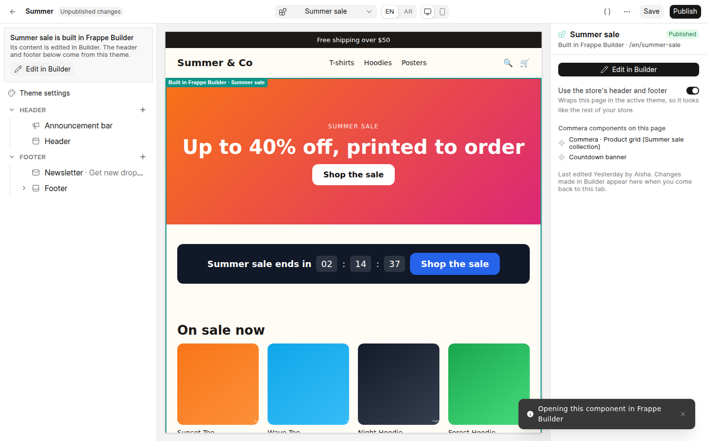

# Theme editor prototype

A frappe-ui prototype of block-based theme customization for Commera's Jinja themes, built to agree
on the interaction before writing the spec. Front-end only: the storefront preview is plain JS
standing in for the Jinja section templates, and localStorage stands in for the site database.

```bash
npm install
npm run build && npm run verify   # 17 browser checks, screenshots in ./screenshots
npm run dev                       # http://localhost:5173 to click around
```

## What it shows

- **Themes list → Customize.** Each theme has a Customize button that opens the editor.
- **Three panels.** The section tree (left), the live preview of the page being edited (centre) and
  the selected section's or block's settings (right).
- **Pages.** The page picker switches Home, Product and Collection. Header and footer sections are
  shared across pages; the Template group belongs to the page.
- **Two ways to select.** Click a section or block in the preview, or in the tree. The other side
  follows, and the settings panel shows the generated form.
- **Tree editing.** Drag to reorder (sections within their group, blocks within their section), hide,
  duplicate, remove, add a section from the theme's presets, add a block (theme blocks, or app blocks
  where the section accepts them). The page's main section can't be removed.
- **App blocks.** The Product page's main section holds the Printful *Size chart* block. The theme
  only says the section accepts app blocks; the app supplies the block.
- **Theme settings.** Colours, heading font and corner radius restyle the whole preview.
- **Bilingual.** EN/AR switches the preview to right-to-left and makes translatable fields edit the
  Arabic value, with English as the placeholder fallback.
- **Desktop / mobile preview.**
- **Save and Publish.** Save keeps a draft; Publish makes it live; Discard returns to what is live.
  **View layout data** shows the JSON a site would store for the page. Theme files are never written.

## Where Frappe Builder comes in

Builder is the second, free-form option next to the section-based theme. The prototype shows every
point where Commera hands off to it; all links are built in one place, `src/theme/builder.js`.

| Where | What the merchant does | Link Commera opens |
| --- | --- | --- |
| **Storefront → Pages** | Sees theme pages and Builder pages in one list; *Edit in Builder* on a Builder page | `/builder/page/<name>` (exists today) |
| **Pages → New page** | Picks *Describe it* (Builder's AI), *From a template* or *Blank*, and whether to use the store's header and footer | `/builder/page/new?prompt=…&template=…&layout=commera-theme` (`new` exists; the parameters are the proposed hooks) |
| **Theme editor page picker** | Builder pages are listed under *Built in Frappe Builder*; *New page…* opens the same dialog | — |
| **Theme editor, Builder page selected** | Previews the page inside the theme's header and footer, toggles that layout, sees the Commera components it uses, *Edit in Builder* | `/builder/page/<name>` |
| **Theme editor, "Builder component" section** | Places a Builder component in any theme page; *Edit in Builder* / *New* | `/builder/component/<name>`, `/builder/component/new` (proposed routes) |

Builder opens in a new tab; returning to the editor re-renders the preview, which is when Builder's
saved changes show up.



## Simpler variations (`/variations`)

The hand-off points above mix two editors in several places. Three simpler variations, each built on
one rule a new merchant can learn; none put Builder inside the theme editor. Screenshots in
`screenshots/variations/`, regenerated with `node variations.mjs`.

| Variation | The rule |
| --- | --- |
| **A · One screen, one tool** | *Theme* is for the store's built-in pages. *Pages* is for pages you add, and they open in Builder. |
| **B · Every page in one list** | *Pages* lists every page: "Store pages" and "Your pages", one Edit button each; the page decides which editor opens. *Look & feel* is only the theme. |
| **C · Text pages vs designed pages** | Text pages (about, FAQ, policies) are written in the dashboard; designed pages open in Builder. You choose when you create one. |

## Storefront hierarchy (`/storefront`)

The direction chosen after the variations. Themes stay the core, organised the way Shopify's Online
Store is. Frappe Builder becomes a *kind of theme*, not a kind of page. Screenshots are in
`screenshots/storefront/`; regenerate them with `node storefront.mjs`.

```
Storefront
├─ Themes         Live theme (Edit theme, ⋯) · Draft themes (Publish, Edit theme)
│   └─ Add theme  ├─ Create with Frappe Builder → a new draft theme with empty pages
│                 └─ Get themes from apps
├─ Pages          rich text content pages (About, FAQ, policies) + "Theme template"
├─ Navigation
└─ Preferences
```

- **Edit theme** always means "change how the store looks". Which editor opens depends on the theme's kind:
  - a sections theme opens the section editor (`/themes/:name/customize`);
  - a Builder theme opens its page list (`/storefront/themes/:name`), and each page opens in Builder.
- **Create with Frappe Builder** creates a theme record flagged `kind: builder` and one empty Builder page for each theme page: Header & footer, Home, Product, Collection, Content page, and an optional Cart. The theme is a draft until the required pages are designed; after that it can be published like any other theme.
- **Theme settings** (colours and fonts) belong to the theme, whatever its kind. Builder pages and content pages both read them.
- **Pages** are only content: the title, rich text (English and Arabic), visibility and SEO fields. The live theme lays them out:
  - in a sections theme, through a `page.*` template the merchant picks under "Theme template";
  - in a Builder theme, through its Content page, where a "Page content" block shows the text.

  Content pages therefore survive a theme switch.

## How the parts map to the real thing

| Prototype | Commera |
| --- | --- |
| `src/theme/schemas.js` | One `sections/<type>.json` per Jinja section in the theme |
| `src/theme/layouts.js` `defaultTheme()` | The theme's default layouts, shipped as files |
| `src/editor/state.js` localStorage | A Theme Layout record per (theme, template) with draft and published layout |
| `src/preview/sections.js` renderers | `sections/<type>.html` Jinja templates, via `render_layout()` / `render_blocks()` |
| `preview.html` + postMessage | The `theme_editor_preview` route rendering the draft layout |
| `FieldControl.vue` | `SettingsFieldControl`, plus colour, image-picker and Builder-component controls |
| `src/theme/builder.js` `BUILDER_PAGES` | Builder Page records, via the proposed `builder_*` hooks |
